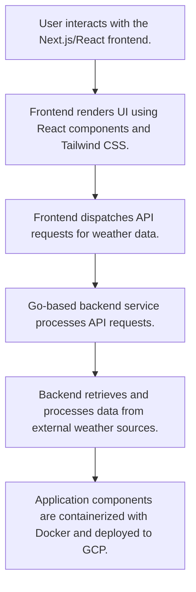

# Weathernext
## Overview
Weathernext is a modern, responsive web application engineered to provide real-time and forecast weather information with a focus on accuracy and user experience. It offers a clean, intuitive interface for accessing current conditions, detailed hourly breakdowns, and multi-day forecasts for any global location. Built primarily with TypeScript and Next.js, it ensures high performance and leverages external APIs for timely data delivery across all devices.

## Business Problem
In today's fast-paced environment, access to reliable and detailed weather information is critical for effective planning and safety. Many existing weather solutions present users with cluttered interfaces, intrusive advertisements, or inconsistent data. Weathernext addresses several key challenges:

*   **Fragmented Information**: Users often resort to multiple sources to gather comprehensive weather insights.
*   **Suboptimal User Experience**: Numerous weather applications suffer from slow load times and non-responsive designs, failing to meet modern web standards.
*   **Lack of Granularity**: General forecasts often lack the detailed hourly or daily breakdowns required for precise decision-making.
*   **Accessibility Issues**: Some platforms are not optimized for cross-device compatibility or lack essential features like robust location search and favorite spot management.

Weathernext consolidates these disparate needs into a single, user-friendly, and highly responsive platform, ensuring users are always well-informed.

## Key Capabilities
*   **Current Weather Conditions**: Displays real-time data including temperature (actual and "feels like"), humidity, wind speed and direction, atmospheric pressure, and a general weather description.
*   **Hourly Forecast**: Offers a detailed 24-48 hour outlook, covering temperature fluctuations, precipitation probability, and wind gusts.
*   **Daily / Extended Forecast**: Provides a clear 5-7 day forecast with high/low temperatures, weather icons, and summary descriptions.
*   **Location Search**: Enables users to search for weather information using city names, zip codes, or geographical coordinates.
*   **Favorite Locations Management**: Allows users to save frequently accessed locations for quick retrieval of their weather details.
*   **Responsive User Interface**: Ensures a seamless experience across various devices, from desktop browsers to mobile phones.
*   **Unit Conversion**: Supports toggling between Celsius and Fahrenheit for temperature, and various units for wind speed (e.g., km/h, mph).
*   **Modern Design**: Features a clean and aesthetically pleasing interface, leveraging Tailwind CSS for rapid and customizable UI development.

## Tech Stack
*   **Frontend Framework**: [Next.js](https://nextjs.org/) (React)
    *   *Rationale:* Facilitates server-side rendering (SSR) or static site generation (SSG) for enhanced performance and SEO, provides integrated API routes for backend logic, and offers an excellent developer experience.
*   **Language**: [TypeScript](https://www.typescriptlang.org/)
    *   *Rationale:* Improves code quality, maintainability, and enables early error detection through static type checking.
*   **Styling**: [Tailwind CSS](https://tailwindcss.com/)
    *   *Rationale:* A utility-first CSS framework that accelerates UI development and allows for highly customizable designs.
*   **API Integration**: [Fetch API](https://developer.mozilla.org/en-US/docs/Web/API/Fetch_API) (natively available in browsers and Node.js)
*   **Weather API**: [OpenWeatherMap API](https://openweathermap.org/api)
    *   *Rationale:* A widely recognized and reliable API offering extensive weather data, including current, hourly, and daily forecasts.
*   **Version Control**: [Git](https://git-scm.com/)
*   **Package Manager**: [Node.js](https://nodejs.org/) / [npm](https://www.npmjs.com/) (also compatible with Yarn/pnpm)
*   **Containerization**: [Docker](https://www.docker.com/)
*   **Cloud Platform**: [Google Cloud Platform (GCP)](https://cloud.google.com/)

## Repository Structure
The project follows a standard Next.js directory structure, complemented by configuration files and documentation for development and deployment.

```
.
├── app/                      # Main Next.js application pages, routes, and layout
├── components/               # Reusable React UI components
├── lib/                      # Utility functions, API helpers, and shared logic
├── store/                    # State management (e.g., using Zustand for global state)
├── types/                    # TypeScript custom type definitions and interfaces
├── .dockerignore             # Specifies files to ignore when building Docker images
├── .env.gcp.example          # Example environment variables for GCP deployment
├── .env.urls                 # Environment variable configurations for external URLs
├── .gitignore                # Specifies intentionally untracked files to ignore
├── Dockerfile                # Defines the Docker image for containerization
├── LOCAL_TEST_GUIDE.md       # Documentation for local testing procedures
├── NCM_TRACKING.md           # Tracking documentation (specific to project needs)
├── QUICK_START_LOCAL.md      # Quick start guide for local development
├── README.md                 # Project overview and setup instructions
├── URL_STRATEGY.md           # Documentation describing URL strategies
├── cloudbuild.yaml           # Configuration file for Google Cloud Build CI/CD
├── next.config.js            # Next.js configuration file
├── package-lock.json         # Records the exact versions of dependencies
├── package.json              # Project metadata and script definitions
├── postcss.config.js         # PostCSS configuration, typically for Tailwind CSS
├── start_weather.sh          # Shell script to start the weather application
├── tailwind.config.js        # Tailwind CSS configuration file
└── tsconfig.json             # TypeScript compiler configuration
```

## Local Setup
To get Weathernext up and running on your local machine, follow these steps:

### Prerequisites
*   Node.js (LTS version recommended)
*   npm or Yarn package manager
*   Git
*   (Optional) Docker for containerized development/testing

### Installation Steps
1.  **Clone the Repository**:
    ```bash
    git clone https://github.com/ramamurthy-540835/weathernext.git
    cd weathernext
    ```

2.  **Install Dependencies**:
    ```bash
    npm install
    # or yarn install
    ```

3.  **Configure Environment Variables**:
    Create a `.env.local` file in the root directory based on `.env.gcp.example` or `.env.urls`. You will need to obtain an API key for the chosen weather service (e.g., OpenWeatherMap).
    ```
    # Example .env.local content
    NEXT_PUBLIC_OPENWEATHER_API_KEY=your_api_key_here
    NEXT_PUBLIC_OPENWEATHER_BASE_URL=https://api.openweathermap.org/data/2.5
    ```
    Replace `your_api_key_here` with your actual API key.

4.  **Run the Application**:
    To start the development server:
    ```bash
    npm run dev
    # or yarn dev
    ```
    The application will typically be accessible at `http://localhost:3000`.

5.  **Run with Docker (Optional)**:
    If you have Docker installed, you can build and run the application in a container:
    ```bash
    docker build -t weathernext .
    docker run -p 3000:3000 weathernext
    ```

## Deployment
Weathernext is designed for deployment on cloud platforms, leveraging containerization and CI/CD practices for efficient and scalable operations.

1.  **Containerization**: The project includes a `Dockerfile` for containerizing the application using Docker, ensuring consistent environments from development to production.
2.  **Cloud Platform**: Deployment to [Google Cloud Platform (GCP)](https://cloud.google.com/) is supported, as indicated by `cloudbuild.yaml` and `.env.gcp.example`. Potential services for deployment include:
    *   **Cloud Run**: For serverless container deployment, automatically scaling based on demand.
    *   **App Engine**: For managed platform-as-a-service deployment.
    *   **Google Kubernetes Engine (GKE)**: For more complex, microservices-based deployments if the project were to expand.
3.  **Continuous Integration/Continuous Deployment (CI/CD)**: The `cloudbuild.yaml` file is configured for Google Cloud Build, enabling automated testing, building of Docker images, and deployment upon code commits to a specified branch.

For detailed deployment instructions, refer to `cloudbuild.yaml` and `.env.gcp.example` for environment variable configurations.

## Demo Workflow
1.  **Access the Application**: Open the Weathernext web application in your browser.
2.  **Search for a Location**: Utilize the prominent search bar to find weather information for any city, zip code, or geographical coordinates (e.g., "London," "90210," "40.7128,-74.0060").
3.  **View Current Conditions**: Upon selecting a location, the main dashboard will display real-time weather data, including temperature, "feels like" temperature, humidity, wind, and a general weather description.
4.  **Explore Hourly Forecast**: Scroll down to see a detailed hourly breakdown for the next 24-48 hours, showing temperature changes, precipitation probability, and wind gusts.
5.  **Check Daily Forecast**: Further down, view the 5-7 day forecast, providing high/low temperatures and summary icons for each day.
6.  **Manage Favorites (Optional)**: If available, use the "Add to Favorites" button to save frequently visited locations for quick access.
7.  **Switch Units (Optional)**: Toggle between Celsius and Fahrenheit for temperature, or different units for wind speed, using the designated UI controls.

## Future Enhancements
*   **Advanced Mapping Integration**: Incorporate interactive weather maps showing precipitation, temperature, and wind overlays.
*   **Historical Weather Data**: Allow users to look up past weather conditions for specific dates and locations.
*   **Weather Alerts and Notifications**: Implement push notifications for severe weather warnings or significant changes in saved locations.
*   **User Accounts & Personalization**: Enable user registration to save preferences, custom dashboards, and more favorite locations across devices.
*   **Additional Weather Metrics**: Display air quality index (AQI), UV index, sunrise/sunset times, and moon phases.
*   **Internationalization (i18n)**: Support multiple languages for a global user base.
*   **Accessibility Improvements**: Further enhance accessibility features for users with disabilities.
## Architecture



For a standalone preview, see [docs/architecture.html](docs/architecture.html).
